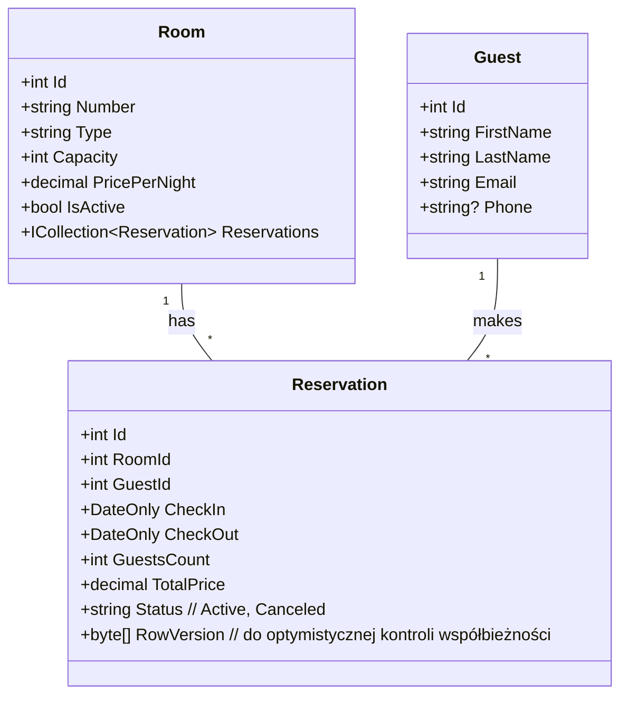

# Projekt zaliczeniowy: **Hotel API** (ASP.NET Core + EF Core)


**Tryb:** praca w parach  
**UI:** brak – wyłącznie interfejs API (REST).  
**Technologie:** .NET 8 LTS (preferowane) lub .NET 9, ASP.NET Core Web API, EF Core (Code‑First), dowolny RDBMS (SQLite/SQL Server/PostgreSQL).  
**Repozytorium**: Własne, prywatne.  
**Polityka PR**: Zmiany w projekcie należy realizować przez Pull request - jeden z członków zespołu robi PR, drugi do sprawdza, nanosi ewentualne uwagi i na końcu merguje do głównej gałęzi.  
**Mile widziane i dodatkowo punktowane**: kontener Docker, wdrożenie na Azure, zbudowanie pipeline CI/CD z wykorzystaniem Github Action, testy wydajnościowe JMeter, NBomber bądź inne narzędzie

Propozycja tematu - Studenci mogą zaproponować swoje rozwiązania, jeśli zawieraja podobny zakres funkcjonalny i wytyczne techniczne

---

## 1) Cel projektu

Zaimplementować minimalistyczny system rezerwacji pokoi hotelowych jako **REST API** z persystencją w bazie danych przy użyciu **Entity Framework Core**. Projekt ma pokazać praktyczne opanowanie: modelowania domeny, reguł biznesowych, projektowania API, walidacji, testów oraz migracji.

---

## 2) Zakres funkcjonalny (MVP)

**Domena i pojęcia:**

* **Room** (pokój): numer, typ, pojemność (capacity), cena za dobę (pricePerNight), status (aktywne/wyłączone z użytku), atrybuty (np. balkon, widok – opcjonalnie).
* **Guest** (gość): imię, nazwisko, e‑mail, telefon (opcjonalnie), dokument tożsamości (opcjonalnie).
* **Reservation** (rezerwacja): roomId, guestId, data od–do (checkIn, checkOut), liczba gości, cena całkowita (liczona przy zapisie), status (aktywna/anulowana).

**Wymagania biznesowe:**

1. **Zakaz nakładania rezerwacji** dla tego samego pokoju (sprawdzenie kolizji dat).
2. **checkIn < checkOut**, minimalnie 1 doba, maksymalnie 30 dób (konfigurowalne).
3. **Liczba gości ≤ capacity** pokoju.
4. **Cena całkowita** = (liczba dób) × (pricePerNight pokoju) – prosto, bez sezonowości (MVP).
5. **Anulowanie** rezerwacji możliwe do chwili check‑in (dla uproszczenia).
6. **Wyszukiwanie dostępności**: zwraca listę pokoi wolnych w zadanym zakresie dat i o minimalnej pojemności.

**Endpoints (MVP):**

* `GET /api/rooms?minCapacity=&onlyActive=` – lista pokoi (filtrowanie, paginacja).
* `GET /api/rooms/{id}` – szczegóły pokoju.
* `POST /api/rooms` – dodaj pokój.
* `PUT /api/rooms/{id}` – edytuj pokój.
* `DELETE /api/rooms/{id}` – (soft‑delete lub deaktywacja – wybierzcie i udokumentujcie).
* `GET /api/guests` / `GET /api/guests/{id}` / `POST /api/guests` / `PUT /api/guests/{id}`.
* `GET /api/reservations/{id}` – szczegóły rezerwacji.
* `POST /api/reservations` – utwórz rezerwację (walidacje + kalkulacja ceny).
* `DELETE /api/reservations/{id}` – anuluj rezerwację (zmiana statusu).
* `GET /api/availability?checkIn=YYYY‑MM‑DD&checkOut=YYYY‑MM‑DD&minCapacity=` – wolne pokoje.

**Błędy i walidacja (przykłady):**

* 400: niepoprawne daty, zbyt duża liczba gości, pokój nieaktywny.
* 409: kolizja rezerwacji (overlap) dla pokoju.
* 404: nie znaleziono zasobu.
* 422: walidacja domenowa (jeśli rozróżniacie od 400 – opcjonalnie).

---

## 3) Wymagania niefunkcjonalne

* **Dokumentacja API:** OpenAPI/Swagger (UI może być włączone tylko w `Development`).
* **Logowanie:** minimalnie logi żądań/odpowiedzi lub kluczowych zdarzeń domenowych.
* **Migracje:** EF Core Migrations + skrypt uruchomieniowy w README.
* **Testy:** min. 5 testów (jednostkowe i/lub integracyjne) obejmujących reguły kolizji oraz kalkulację ceny.
* **Jakość:** czytelna struktura projektu, DTO vs. encje, walidacja atrybutami/FluentValidation.
* **Idempotencja anulowania** (powtórne `DELETE` zwraca 204 lub 409 – wybór udokumentować).

---

## 4) Model danych (propozycja)



---

## 5) Struktura projektu (przykład)

```
Hotel.Api/            // ASP.NET Core Web API (Controllers lub Minimal APIs)
Hotel.Application/    // logika domenowa, usługi, walidacje
Hotel.Infrastructure/ // EF Core, DbContext, migracje, repozytoria
Hotel.Tests/          // xUnit/NUnit + testy integracyjne
```

---

## 6) Przykładowe encje i DbContext (szkic)

```csharp
// Hotel.Infrastructure/Entities/Room.cs
public class Room
{
    public int Id { get; set; }
    public string Number { get; set; } = default!;
    public string Type { get; set; } = "Standard";
    public int Capacity { get; set; }
    public decimal PricePerNight { get; set; }
    public bool IsActive { get; set; } = true;
    public ICollection<Reservation> Reservations { get; set; } = new List<Reservation>();
}

public class Guest
{
    public int Id { get; set; }
    public string FirstName { get; set; } = default!;
    public string LastName { get; set; } = default!;
    public string Email { get; set; } = default!;
    public string? Phone { get; set; }
}

public class Reservation
{
    public int Id { get; set; }
    public int RoomId { get; set; }
    public int GuestId { get; set; }
    public DateOnly CheckIn { get; set; }
    public DateOnly CheckOut { get; set; }
    public int GuestsCount { get; set; }
    public decimal TotalPrice { get; set; }
    public string Status { get; set; } = "Active";
    public byte[] RowVersion { get; set; } = Array.Empty<byte>();

    public Room Room { get; set; } = default!;
    public Guest Guest { get; set; } = default!;
}

// Hotel.Infrastructure/HotelDbContext.cs
public class HotelDbContext(DbContextOptions<HotelDbContext> options) : DbContext(options)
{
    public DbSet<Room> Rooms => Set<Room>();
    public DbSet<Guest> Guests => Set<Guest>();
    public DbSet<Reservation> Reservations => Set<Reservation>();

    protected override void OnModelCreating(ModelBuilder b)
    {
        b.Entity<Room>().HasIndex(r => r.Number).IsUnique();
        b.Entity<Reservation>().Property(x => x.RowVersion).IsRowVersion();
    }
}
```

---

## 7) Przykładowy `Program.cs` (minimalny szkielet)

```csharp
var builder = WebApplication.CreateBuilder(args);

builder.Services.AddDbContext<HotelDbContext>(opt =>
{
    // Zmień na wybrany provider (np. SQL Server):
    opt.UseSqlite(builder.Configuration.GetConnectionString("HotelDb"));
});

builder.Services.AddEndpointsApiExplorer();
builder.Services.AddSwaggerGen();

var app = builder.Build();

if (app.Environment.IsDevelopment())
{
    app.UseSwagger();
    app.UseSwaggerUI();
}

app.MapGet("/api/availability", async (
    DateOnly checkIn, DateOnly checkOut, int minCapacity, HotelDbContext db) =>
{
    if (checkIn >= checkOut) return Results.BadRequest("checkIn must be < checkOut");

    // Pokoje, które NIE mają rezerwacji kolidującej z zadanym zakresem
    var unavailableRoomIds = await db.Reservations
        .Where(r => r.Status == "Active" &&
                    r.CheckIn < checkOut && checkIn < r.CheckOut)
        .Select(r => r.RoomId)
        .Distinct()
        .ToListAsync();

    var rooms = await db.Rooms
        .Where(r => r.IsActive && r.Capacity >= minCapacity && !unavailableRoomIds.Contains(r.Id))
        .ToListAsync();

    return Results.Ok(rooms);
});

app.Run();
```

---

## 8) Przykład walidacji kolizji przy tworzeniu rezerwacji

```csharp
// Warunek kolizji (overlap): (A.start < B.end) && (B.start < A.end)
var hasOverlap = await db.Reservations.AnyAsync(r =>
    r.RoomId == dto.RoomId && r.Status == "Active" &&
    r.CheckIn < dto.CheckOut && dto.CheckIn < r.CheckOut);
if (hasOverlap) return Results.Conflict("Room already booked in this period");
```

---

## 9) Dane startowe (seed – opcjonalnie)

* 6–10 pokoi (różne pojemności i ceny).
* 3–5 gości testowych.
* 1–2 rezerwacje przykładowe w przyszłości.

Przykład inicjalizacji w `DbContext` lub dedykowany `Seeder` uruchamiany przy starcie.

---

## 10) Testy – przykładowe przypadki

1. **Kolizja rezerwacji**: próba utworzenia rezerwacji dla pokoju z nachodzącymi datami → `409`.
2. **Walidacja dat**: `checkIn >= checkOut` → `400`.
3. **Pojemność**: liczba gości > capacity → `400`.
4. **Cena**: 3 doby × 250 = 750 → prawidłowa kalkulacja w `TotalPrice`.
5. **Dostępność**: pokój z aktywną rezerwacją nie pojawia się na liście `GET /api/availability`.

---

## 11) Kryteria oceny (100 pkt)

* **Poprawność domeny i reguł (30 pkt)** – brak kolizji, walidacja, kalkulacja ceny.
* **Projekt API (20 pkt)** – spójne zasoby, statusy HTTP, błędy, paginacja.
* **Persistencja i migracje (15 pkt)** – model EF, migracje, seed.
* **Jakość kodu (15 pkt)** – podział na warstwy/Foldery, DTO, mapowanie, SRP.
* **Testy (10 pkt)** – min. 5 sensownych testów przechodzących w CI.
* **Dokumentacja i README (10 pkt)** – opis uruchomienia, przykłady żądań, decyzje.

Bonus (do +10 pkt): paginacja/sortowanie; optymistyczna współbieżność (`RowVersion`); filtrowanie po typie pokoju; prosta **reguła cenowa** (np. weekend droższy o 10%).

---

## 12) Dostarczenie i repozytorium

W repo umieśćcie:

* **Kod źródłowy** z podziałem na projekty/foldery.
* **README.md** z: wymaganiami, instrukcją `dotnet ef database update`, przykładowymi curl/HTTP, opisem decyzji.
* **Plik konfig.** `appsettings.json` z connection string (lub `appsettings.Development.json`).
* **Kolekcję Postmana/Insomni** (lub `http` files dla Rider/VSCode) z przykładami wywołań.
* **Workflow CI** (opcjonalnie): build + testy (GitHub Actions – mile widziane).

Termin i sposób oddania – wg ustaleń na zajęciach.

---

## 13) Komendy startowe (podpowiedź)

```bash
# Szablon
 dotnet new webapi -n Hotel.Api

# Pakiety (przykład: SQLite)
 dotnet add Hotel.Api package Microsoft.EntityFrameworkCore.Sqlite
 dotnet add Hotel.Api package Microsoft.EntityFrameworkCore.Design
 dotnet add Hotel.Api package Swashbuckle.AspNetCore

# Narzędzie EF
 dotnet tool install --global dotnet-ef

# Migracja + baza
 dotnet ef migrations add InitialCreate --project Hotel.Api
 dotnet ef database update --project Hotel.Api

# Uruchomienie
 dotnet run --project Hotel.Api
```

---

## 14) Przykładowe DTO i odpowiedzi

```csharp
public record CreateReservationDto(
    int RoomId,
    int GuestId,
    DateOnly CheckIn,
    DateOnly CheckOut,
    int GuestsCount);

public record ReservationDto(
    int Id,
    int RoomId,
    int GuestId,
    DateOnly CheckIn,
    DateOnly CheckOut,
    int GuestsCount,
    decimal TotalPrice,
    string Status);
```

**Przykładowy request:**

```http
POST /api/reservations HTTP/1.1
Content-Type: application/json

{
  "roomId": 3,
  "guestId": 7,
  "checkIn": "2025-11-10",
  "checkOut": "2025-11-13",
  "guestsCount": 2
}
```

**Odpowiedź 201:**

```json
{
  "id": 42,
  "roomId": 3,
  "guestId": 7,
  "checkIn": "2025-11-10",
  "checkOut": "2025-11-13",
  "guestsCount": 2,
  "totalPrice": 750.00,
  "status": "Active"
}
```

---


## 15) Wskazówki architektoniczne

* Oddzielcie **DTO** od encji EF (mapowanie ręczne lub biblioteka).
* Umieśćcie reguły domenowe w **serwisach aplikacyjnych** (nie w kontrolerach, nie w DbContext).
* Walidacja danych wejściowych: **FluentValidation** lub atrybuty.
* Zadbajcie o **transakcje** przy tworzeniu rezerwacji (jeśli dodajecie więcej agregatów).
* Rozważcie **optymistyczną współbieżność** (`RowVersion`) dla anulowania/edycji.

---
